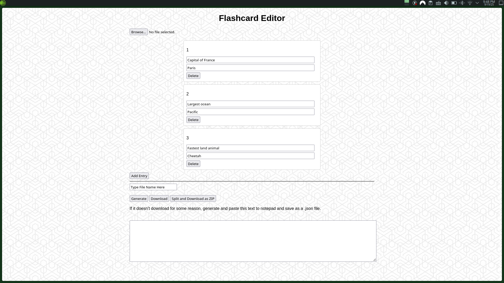

# Hosted on Github Pages - [Here](https://kentuckyfriedrice.github.io/flashcardDeckManager/)

This is a barebones JSON editor to go in collaboration with my other project, *vocabQuiz* (*Link Below*).

This would allow teachers to create custom flashcard sets for students to practice vocabulary via typing. To preserve the security of the network of the school I work for, I desided to host both *vocabQuiz* and *flashcardDeckManager* on Github pages instead of a custom Amazon Web Services (AWS) EC2 server. This decision hindered my plans for a login system, of which you can find evidence of from the contents of the folder labeled "login".

However, for the test case I made the current solution where the teacher creates the JSON vocabulary deck and I insert it into the *vocabQuiz* project directly. Not very elegant but for the trial run it was successful. Unfortunately the trial run, itself, was not successful. Therefore, I will not be working on this project any longer. 

### How To Use
At the top, there is a *browse* button. This allows you to load in a deck file to edit or append to. 

From there, you will see the cards themselves lined up one-by-one stacked on top of one another. I tried to make them look like a card so the teachers felt more familiar with the format despite its oveall clunky and rushed design.
You will see the number of the card, the question, the answer, and a delete button. I felt this was the simplest and most effective way to go about this.

After the cards you will find an *Add Entry* button. This does what one might think and appends an additional card to the deck.

Following the horizontal rule, this is the area I have decided to call the "save section." This entire space is dedicated to saving the cards as a JSON deck file. I was worried about my solution of creating the JSON file in browser behind the scenes, so I also included a redudant space to copy and paste the content into a JSON file manually. At this point in the project it was important to convince the teachers I was doing the trial run with that this was a stable and trustworthy application. I felt that a redundant feature such as this would have prevented any hard work from going missing in case something went wrong. 

| Button | Function |
-----|-----
| Generate | This generates the content of the JSON file in the text box. Redundant, but I added it first so users clicked it first just in case. |
| Download | This creates on big JSON file for all the contents at one time. |
| Split and Download as Zip | This creates multiple JSON files for every 10 cards and zips them together. This allows for students to study 10 words at a time or multiples of 10 words at a time. Useful for big sets. |

If anybody wants to use this for their own work, feel free. I hope that this project can be used for something else in the future. 
